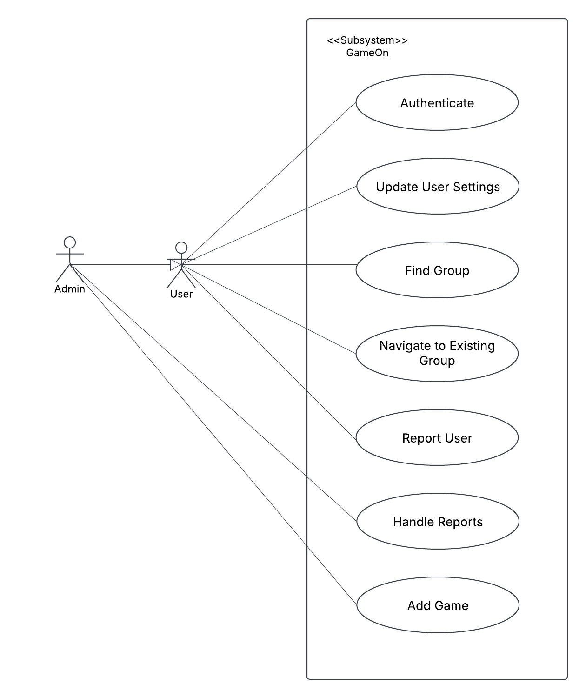
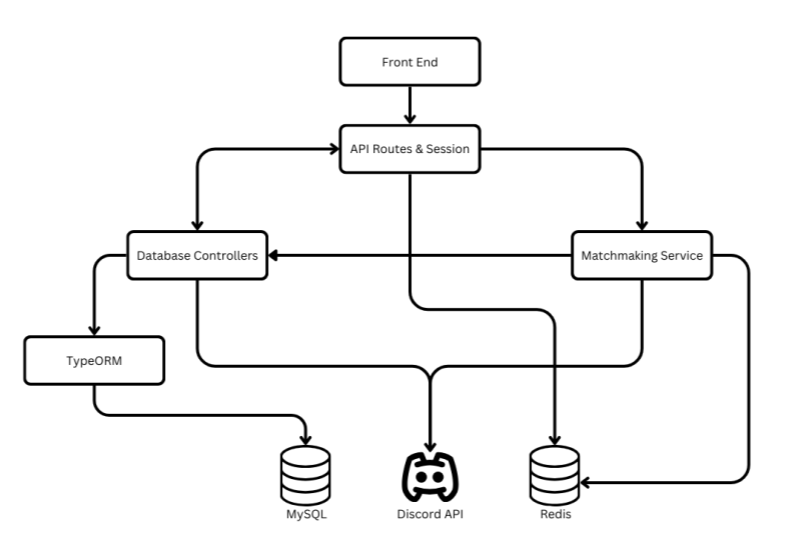
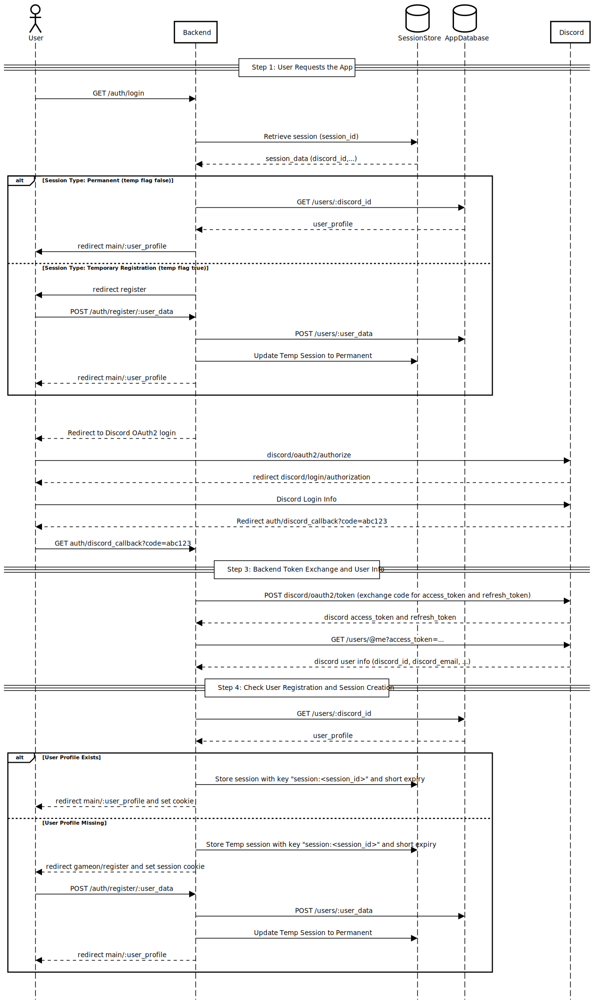
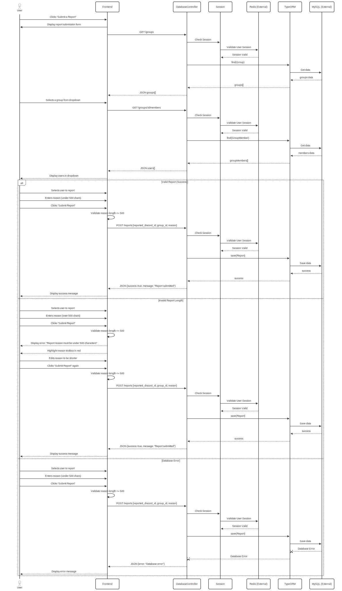

# M3 - Requirements and Design

## 1. Change History
### Change History

### March 1st 2025 Changes
### 3.3.1 Sign In
- **Change**: Users must register with our app after successfully signing in with Discord. If they haven't registered yet, they will be taken to the account creation screen, where they must enter their registration preferences, including Spoken Language, Region, Timezone, Skill Level, and Game.
- **Modified Sections**: Functional Requirements: Sign In.
- **Rationale**: Added the additional requirement for users to register with our app. The updated preferences better represent what a user should provide.
  
#### 4.1 Admin Routes
- **Change**: Added interfaces for retrieving, creating, updating, and deleting admins.
- **Modified Sections**: Admin Routes section.
- **Rationale**: Provides a detailed breakdown of admin-related operations, ensuring clarity and completeness in managing admin users.

#### 4.1 Auth Routes
- **Change**: Added interfaces for login, callback, registration, logout, and redirect.
- **Modified Sections**: Auth Routes section.
- **Rationale**: Ensures secure user authentication and authorization using Discord's OAuth2, providing a clear flow for user login and registration.

#### 4.1 Game Routes
- **Change**: Added interfaces for retrieving, creating, updating, and deleting games.
- **Modified Sections**: Game Routes section.
- **Rationale**: Provides a centralized way to manage games, ensuring consistency and ease of access.

#### 4.1 Group Routes
- **Change**: Added interfaces for retrieving, creating, updating, and deleting groups, as well as joining and leaving groups.
- **Modified Sections**: Group Routes section.
- **Rationale**: Provides a centralized way to manage groups, ensuring consistency and ease of access.

#### 4.1 Matchmaking Routes
- **Change**: Added interfaces for initiating matchmaking and checking matchmaking status.
- **Modified Sections**: Matchmaking Routes section.
- **Rationale**: Provides a centralized way to handle matchmaking requests, ensuring consistency and ease of access.

#### 4.1 Preferences Routes
- **Change**: Added interfaces for retrieving, creating, updating, and deleting preferences.
- **Modified Sections**: Preferences Routes section.
- **Rationale**: Provides a centralized way to manage user preferences, ensuring consistency and ease of access.

#### 4.1 Report Routes
- **Change**: Added interfaces for retrieving, creating, resolving, and deleting reports.
- **Modified Sections**: Report Routes section.
- **Rationale**: Provides a centralized way to handle user reports, ensuring consistency and ease of access.

#### 4.1 User Routes
- **Change**: Added interfaces for retrieving, creating, updating, and deleting users, as well as managing user groups and banning users.
- **Modified Sections**: User Routes section.
- **Rationale**: Provides a centralized way to manage users, ensuring consistency and ease of access.
#### 4.1 Authentication
- **Change**: Documentation format change
- **Modified Sections**: Authentication Routes section.
- **Rationale**: The original purpose and interfaces for authentication remain relevant and accurate. We lost marks for formatting however.

#### 4.1 Sign In
- **Change**: Documentation format change
- **Modified Sections**: Sign In section.
- **Rationale**: The original purpose and interfaces for sign-in remain relevant and accurate. We lost marks for formatting however.

#### 4.1 User Management
- **Change**: Documentation format change
- **Modified Sections**: User Management section.
- **Rationale**: The original purpose and interfaces for user management remain relevant and accurate. We lost marks for formatting however.

#### 4.1 Matchmaking
- **Change**: Documentation format change
- **Modified Sections**: Matchmaking section.
- **Rationale**: The original purpose and interfaces for matchmaking remain relevant and accurate. We lost marks for formatting however.

#### 4.1 Group Management
- **Change**: Documentation format change
- **Modified Sections**: Group Management section.
- **Rationale**: The original purpose and interfaces for group management remain relevant and accurate. We lost marks for formatting however.

#### 4.1 Report Management
- **Change**: Documentation format change
- **Modified Sections**: Report Management section.
- **Rationale**: The original purpose and interfaces for report management remain relevant and accurate. We lost marks for formatting however.

#### 4.1 Admin Management
- **Change**: Documentation format change
- **Modified Sections**: Admin Management section.
- **Rationale**: The original purpose and interfaces for admin management remain relevant and accurate. We lost marks for formatting however.

#### 4.2 Databases
- **Change**: Updated the purpose and details of the GameOnDB (MySQL) and Redis databases.
- **Modified Sections**: Databases section.
- **Rationale**: Expanded the description to include more specific details about the tables and the use of Redis for session management, caching, and matchmaking queues.

#### 4.3 External Modules
- **Change**: Added a new section for External Modules.
- **Modified Sections**: External Modules section.
- **Rationale**: Provides clarity on the use of the Discord API for authentication and creating matchmaking groups, ensuring a comprehensive understanding of external dependencies.
  
#### 4.6 Functional Requirements Sequence Diagram
- **Change**: Updated UML diagram for Signin.
- **Modified Sections**: Functional Requirements Sequence Diagram.
- **Rationale**: Design was updated.

### March 1st 2025 Changes
#### 3.1 Use Case Diagram
- **Change**: Updated use case diagram.
- **Modified Sections**: Use case diagram.
- **Rationale**: Updated based on M3 TA feedback.

#### 4.4 Frameworks
- **Change**: Remove android studio.
- **Modified Sections**: Frameworks.
- **Rationale**: Updated based on M3 TA feedback.

#### 5. Contributions
- **Change**: Add contributions.
- **Modified Sections**: Contributions
- **Rationale**: Updated based on M3 TA feedback.

#### 3.3 Functional Requirements
- **Change**: Fix use case scenarios for all functional requirements.
- **Modified Sections**: Functional Requirements
- **Rationale**: Updated based on M3 TA feedback.

#### 3.3 Non Functional Requirements
- **Change**: Fix non functional requirements.
- **Modified Sections**: Non Functional Requirements
- **Rationale**: Updated based on M3 TA feedback.

## 2. Project Description
**GameOn** is a social matchmaking platform designed for gamers to find ideal teammates and build lasting connections. By authenticating through Discord, players create personalized profiles, sharing details like preferred games, skill levels, communication styles, and playstyles. The app intelligently matches players based on their preferences, instantly creating a dedicated Discord group for seamless in-game coordination and ongoing communication. With integrated feedback systems, including reviews and ratings, GameOn fosters a supportive and positive gaming community.

## 3. Requirements Specification
### **3.1. Use-Case Diagram**


### **3.2. Actors Description**
1. **User**: A player who uses Discord authentication to access the app. They can set preferences, join groups via group matching, interact with other users, and report users if needed.
2. **Admin**: A system administrator who monitors user reports and has the authority to ban users if necessary, ensuring a safe and fair community environment.


### **3.3. Functional Requirements**
<a name="fr1"></a>

1. **Authenticate** 
    - **Overview**:
        1. Login
        2. Register
    
    - **Detailed Flow for Each Independent Scenario**: 
        1. **Login**:
            - **Description**: Users are prompted to sign in with Discord. If they have already signed in with Discord and registered with our app they are taken to the home screen.
            - **Primary actor(s)**: User 
            - **Main success scenario**:
                1. User opens the app.
                2. System displays the login screen with a "Sign in with Discord" button.
                3. User clicks "Sign in with Discord."
                4. System redirects the user to Discord’s authentication page.
                5. User enters Discord credentials and submits the form.
                6. System validates the credentials with Discord API.
                7. System checks if the user has a registered profile in the app.
                8. If registered, system redirects the user to the home screen.
                9. User successfully accesses the app.
            - **Failure scenario(s)**:
                - 1a. Unsuccessful sign-in via Discord authentication.
                    - 1a1. User enters incorrect Discord credentials.
                    - 1a2. System displays an "Invalid credentials" error message.
                    - 1a3. User is prompted to re-enter credentials.
        2. **Register**:
            - **Description**: Users are prompted to sign in with Discord. If they haven't registered with our app, they are taken to the account creation screen, where they must enter their registration preferences, including Spoken Language, Region, Timezone, Skill Level, and Game.
            - **Primary actor(s)**: User 
            - **Main success scenario(s)**:
                1. User clicks "Sign in with Discord."
                2. System redirects to Discord authentication.
                3. User enters credentials, and system verifies them.
                4. If new user, system prompts for preferences.
                5. User fills in and submits the form.
                6. System saves profile and redirects to the home screen.
            - **Failure scenario(s)**:
                - 1a. Unsuccessful sign-in via Discord authentication.
                    - 1a1. Incorrect credentials are provided.
                - 2a. User fails to provide all required fields.
                    - 2a1. User must be prompted to fill in missing fields.
                - 2b: User leaves and closes application before all imformation is filled. Registration does not occur.

<a name="fr2"></a>

2.  **Update User Settings** 
    - **Overview**:
        1. View and Change Settings
    
    - **Detailed Flow for Each Independent Scenario**: 
        1. **View and Change Settings**:
            - **Description**: When clicking their avatar in the top right of the screen, users are taken to their account settings page, where they can change their spoken language preferences, and time zone.
            - **Primary actor(s)**: User
            - **Main success scenario**:
                1. User clicks their avatar to open settings.
                2. System displays the user’s current settings.
                3. User modifies settings (e.g., avatar, language, timezone).
                4. User presses "Confirm," and system updates the database.
                5. System confirms the update and redirects the user to the previous screen.
            - **Failure scenario(s)**:
                - 1a. Actor leaves this screen without submitting, no settings are updated.

<a name="fr3"></a>

3.  **Find Group** 
    - **Overview**:
        1. Looking for Group
    
    - **Detailed Flow for Each Independent Scenario**: 
        1. **Looking for Group**:
            - **Description**: When clicking the “Find Group” button in the app, the user is entered into the matchmaking queue, and once a group is found or the timeout is reached a popup appears informing the user of the matchmaking status.
            - **Primary actor(s)**: User 
            - **Main success scenario**:
                1. User clicks the “Find Group” button.
                2. A matchmaking request is submitted, and the user is in the matchmaking queue.
                3. The app polls for the matchmaking status.
                4. A group is found and the success popup is displayed.
                5. The new group appears in the "view existing group" section
            - **Failure scenario(s)**:
                - 1a. Not enough users in queue, After a timeout, the system removes the user from matchmaking queue and displays a timeout popup.


<a name="fr4"></a>

4.  **Navigate to Existing Group** 
    - **Overview**:
        1. Navigate to Existing Group Page
    
    - **Detailed Flow for Each Independent Scenario**: 
        1. Navigate to Existing Group Page:
            - **Description**: When a user clicks on an existing group from the “My Groups” banner, they are taken to the existing group page.
            - **Primary actor(s)**: User 
            - **Main success scenario**:
                1. User clicks on an existing group from the "My Groups" section.
                2. System retrieves group details from the database.
                3. System navigates the user to the "Existing Group" screen.
            - **Failure scenario(s)**:
                - 1a. Group not found in database, user is not routed to existing group page.

<a name="fr5"></a>

5.  **Report User** 
    - **Overview**:
        1. Submit Report
    
    - **Detailed Flow for Each Independent Scenario**: 
        1. **Submit Report**:
            - **Description**: When a user long-presses a user within the "Existing Group"  screen, an option appears to “Report User”.  Upon clicking “Report User”, a pop-up appears where a user can write a summary on why the user is being reported.  Upon clicking “Submit”, the report is submitted to the administrators.
            - **Primary actor(s)**: User, Admin 
            - **Main success scenario**:
                1. User selects the "Submit a report" button
                2. User selects a group from the dropdown
                3. User selects a user to report from the dropdown
                4. User writes a reason for the report
                5. User selects "Submit report"
                6. System successfully sends the report to the database
            - **Failure scenario(s)**:
                - 2a. User does not click “Submit” and the report is not submitted to the admin.
                - 2b. User presses "Cancel" and report is not submitted.

<a name="fr6"></a>

6.  **Handle Reports** 
    - **Overview**:
        1. Ban User
        2. Acquit User
    
    - **Detailed Flow for Each Independent Scenario**: 
        1. **Ban User**:
            - **Description**: Admins view and action user reports from the view reports screen. Admin has the option to ban a user based on the summary they've been provided.
            - **Primary actor(s)**: Admin 
            - **Main success scenario**:
                1. Admin clicks "View reports"
                2. Admin selects the desired report from the list
                3. Admin selects "Ban user"
                4. Once the user logs out, they will hit the banned user screen when attempting to log back in.
            - **Failure scenario(s)**:
                - 1a. System error prevents banning the user. Admin selects "Ban User," but a database or server error occurs, preventing the ban.

        2. **Acquit User**:
            - **Description**: Admins view and action user reports from the view reports screen. Admin has the option to *not* ban the user based on the summmary they've been provided.
            - **Primary actor(s)**: Admin 
            - **Main success scenario**:
                1. Admin clicks "View reports"
                2. Admin selects the desired report from the list
                3. Admin selects "Acquit User"
                4. User can continue using the app normally.
            - **Failure scenario(s)**:
                - 1a. System error prevents acquiting the user. Admin selects "Acquit User," but a database or server error occurs, preventing the ban.

### **3.4. Screen Mockups**

### **3.5. Non-Functional Requirements**
<a name="#nfr1"></a>

1. **Matchmaking Time**
    - **Description**:   Users should be matched within 5 minutes of initiating the matchmaking process. If a match is not found within this time, the system should notify the user and allow them to reattempt matchmaking.
    - **Justification**: Studies on online gaming matchmaking show that players expect matchmaking to occur within 2-5 minutes before frustration sets in. According to user engagement studies, wait times exceeding 5 minutes significantly decrease retention rates. This requirement ensures that matchmaking is fast enough to keep users engaged.

<a name="#nfr2"></a>

2. **Arbitrary Group Limit**
    - **Description**: Users should be able to join multiple groups without arbitrary restrictions, limited only by system capacity and the number of available matchmaking groups.
    - **Justification**: Many gamers participate in multiple communities across different games. Platforms like Discord and Steam allow users to be part of several groups simultaneously without limitations. Restricting users arbitrarily could result in poor user retention.


## 4. Designs Specification
### **4.1. Main Components**

#### **Admin Routes**
- **Purpose**: Manages admin-related operations such as retrieving, creating, updating, and deleting admins.
- **Rationale**: Provides a centralized way to manage admin users, ensuring only authorized users have access to admin functionalities.
- **Interfaces**:
    1. **GET /admins**
        - **Parameters**: None
        - **Return Value**: JSON array of admin objects
        - **Description**: Fetches all admin users from the database.
    2. **GET /admins/:id**
        - **Parameters**: admin ID (URL parameter)
        - **Return Value**: JSON object of the admin
        - **Description**: Fetches a specific admin user based on the provided ID.
    3. **POST /admins**
        - **Parameters**: JSON object with discord_id and permissions
        - **Return Value**: JSON object of the created admin
        - **Description**: Adds a new admin user to the database.
    4. **PUT /admins/:id**
        - **Parameters**: admin ID (URL parameter), JSON object with updated permissions
        - **Return Value**: JSON object of the updated admin
        - **Description**: Updates the permissions of an existing admin user.
    5. **DELETE /admins/:id**
        - **Parameters**: admin ID (URL parameter)
        - **Return Value**: JSON object with a success message
        - **Description**: Removes an admin user from the database.

#### **Auth Routes**
- **Purpose**: Handles authentication and authorization processes, including login, registration, and logout.
- **Rationale**: Ensures secure user authentication and authorization using Discord's OAuth2.
- **Interfaces**:
    1. **GET /auth/login**
        - **Parameters**: None
        - **Return Value**: Redirect to Discord's OAuth2 login page
        - **Description**: Starts the OAuth2 login process.
    2. **GET /auth/callback_discord**
        - **Parameters**: None
        - **Return Value**: JSON object with user information
        - **Description**: Processes the OAuth2 callback and retrieves user information.
    3. **POST /auth/register**
        - **Parameters**: JSON object with user details
        - **Return Value**: JSON object of the registered user
        - **Description**: Registers a new user in the system.
    4. **POST /auth/logout**
        - **Parameters**: None
        - **Return Value**: JSON object with a success message
        - **Description**: Logs out the current user and ends their session.
    5. **GET /auth/redirect**
        - **Parameters**: None
        - **Return Value**: Redirect to the frontend with the authorization code
        - **Description**: Redirects the user to the frontend application with the authorization code.

#### **Game Routes**
- **Purpose**: Manages game-related operations such as retrieving, creating, updating, and deleting games.
- **Rationale**: Provides a centralized way to manage games, ensuring consistency and ease of access.
- **Interfaces**:
    1. **GET /games**
        - **Parameters**: None
        - **Return Value**: JSON array of game objects
        - **Description**: Fetches all games from the database.
    2. **GET /games/:id**
        - **Parameters**: game ID (URL parameter)
        - **Return Value**: JSON object of the game
        - **Description**: Fetches a specific game based on the provided ID.
    3. **POST /games**
        - **Parameters**: JSON object with game_name and description
        - **Return Value**: JSON object of the created game
        - **Description**: Adds a new game to the database.
    4. **PUT /games/:id**
        - **Parameters**: game ID (URL parameter), JSON object with updated game_name and description
        - **Return Value**: JSON object of the updated game
        - **Description**: Updates the details of an existing game.
    5. **DELETE /games/:id**
        - **Parameters**: game ID (URL parameter)
        - **Return Value**: JSON object with a success message
        - **Description**: Removes a game from the database.

#### **Group Routes**
- **Purpose**: Manages group-related operations such as retrieving, creating, updating, and deleting groups, as well as joining and leaving groups.
- **Rationale**: Provides a centralized way to manage groups, ensuring consistency and ease of access.
- **Interfaces**:
    1. **GET /groups**
        - **Parameters**: None
        - **Return Value**: JSON array of group objects
        - **Description**: Fetches all groups from the database.
    2. **GET /groups/:id**
        - **Parameters**: group ID (URL parameter)
        - **Return Value**: JSON object of the group
        - **Description**: Fetches a specific group based on the provided ID.
    3. **POST /groups**
        - **Parameters**: JSON object with game_id, group_name, and max_players
        - **Return Value**: JSON object of the created group
        - **Description**: Adds a new group to the database.
    4. **PUT /groups/:id**
        - **Parameters**: group ID (URL parameter), JSON object with updated group_name and max_players
        - **Return Value**: JSON object of the updated group
        - **Description**: Updates the details of an existing group.
    5. **DELETE /groups/:id**
        - **Parameters**: group ID (URL parameter)
        - **Return Value**: JSON object with a success message
        - **Description**: Removes a group from the database.
    6. **POST /groups/:id/join**
        - **Parameters**: group ID (URL parameter)
        - **Return Value**: JSON object with a success message
        - **Description**: Adds the current user to the specified group.
    7. **DELETE /groups/:id/leave**
        - **Parameters**: group ID (URL parameter)
        - **Return Value**: JSON object with a success message
        - **Description**: Removes the current user from the specified group.
    8. **GET /groups/:id/members**
        - **Parameters**: group ID (URL parameter)
        - **Return Value**: JSON array of group member objects
        - **Description**: Fetches all members of the specified group.
    9. **GET /groups/:id/url**
        - **Parameters**: group ID (URL parameter)
        - **Return Value**: JSON object with the group's URL
        - **Description**: Fetches the URL of the specified group.

#### **Matchmaking Routes**
- **Purpose**: Manages matchmaking-related operations such as initiating matchmaking and checking matchmaking status.
- **Rationale**: Provides a centralized way to handle matchmaking requests, ensuring consistency and ease of access.
- **Interfaces**:
    1. **POST /matchmaking/initiate**
        - **Parameters**: JSON object with preference_id
        - **Return Value**: JSON object with a success message
        - **Description**: Starts the matchmaking process based on the provided preferences.
    2. **GET /matchmaking/status/:discord_id**
        - **Parameters**: discord ID (URL parameter)
        - **Return Value**: JSON object with the matchmaking status
        - **Description**: Retrieves the matchmaking status for the specified user.

#### **Preferences Routes**
- **Purpose**: Manages preference-related operations such as retrieving, creating, updating, and deleting preferences.
- **Rationale**: Provides a centralized way to manage user preferences, ensuring consistency and ease of access.
- **Interfaces**:
    1. **GET /preferences**
        - **Parameters**: None
        - **Return Value**: JSON array of preference objects
        - **Description**: Fetches all preferences from the database.
    2. **GET /preferences/:id**
        - **Parameters**: preference ID (URL parameter)
        - **Return Value**: JSON object of the preferences
        - **Description**: Fetches specific preferences based on the provided ID.
    3. **POST /preferences**
        - **Parameters**: JSON object with discord_id, spoken_language, time_zone, skill_level, and game_id
        - **Return Value**: JSON object of the created preferences
        - **Description**: Adds new preferences to the database.
    4. **PUT /preferences/:id**
        - **Parameters**: preference ID (URL parameter), JSON object with updated spoken_language, time_zone, and skill_level
        - **Return Value**: JSON object of the updated preferences
        - **Description**: Updates the details of existing preferences.
    5. **DELETE /preferences/:id**
        - **Parameters**: preference ID (URL parameter)
        - **Return Value**: JSON object with a success message
        - **Description**: Removes preferences from the database.

#### **Report Routes**
- **Purpose**: Manages report-related operations such as retrieving, creating, resolving, and deleting reports.
- **Rationale**: Provides a centralized way to handle user reports, ensuring consistency and ease of access.
- **Interfaces**:
    1. **GET /reports**
        - **Parameters**: None
        - **Return Value**: JSON array of report objects
        - **Description**: Fetches all reports from the database.
    2. **GET /reports/:id**
        - **Parameters**: report ID (URL parameter)
        - **Return Value**: JSON object of the report
        - **Description**: Fetches a specific report based on the provided ID.
    3. **POST /reports**
        - **Parameters**: JSON object with reported_discord_id, group_id, and reason
        - **Return Value**: JSON object of the created report
        - **Description**: Adds a new report to the database.
    4. **PUT /reports/:id/resolve**
        - **Parameters**: report ID (URL parameter), JSON object with resolved status
        - **Return Value**: JSON object of the resolved report
        - **Description**: Updates the status of a report to resolved.
    5. **DELETE /reports/:id**
        - **Parameters**: report ID (URL parameter)
        - **Return Value**: JSON object with a success message
        - **Description**: Removes a report from the database.

#### **User Routes**
- **Purpose**: Manages user-related operations such as retrieving, creating, updating, and deleting users, as well as managing user groups and banning users.
- **Rationale**: Provides a centralized way to manage users, ensuring consistency and ease of access.
- **Interfaces**:
    1. **GET /users**
        - **Parameters**: None
        - **Return Value**: JSON array of user objects
        - **Description**: Fetches all users from the database.
    2. **GET /users/:id**
        - **Parameters**: user ID (URL parameter)
        - **Return Value**: JSON object of the user
        - **Description**: Fetches a specific user based on the provided ID.
    3. **POST /users**
        - **Parameters**: JSON object with discord_id, username, and email
        - **Return Value**: JSON object of the created user
        - **Description**: Adds a new user to the database.
    4. **PUT /users/:id**
        - **Parameters**: user ID (URL parameter), JSON object with updated username and email
        - **Return Value**: JSON object of the updated user
        - **Description**: Updates the details of an existing user.
    5. **DELETE /users/:id**
        - **Parameters**: user ID (URL parameter)
        - **Return Value**: JSON object with a success message
        - **Description**: Removes a user from the database.
    6. **GET /users/:id/groups**
        - **Parameters**: user ID (URL parameter)
        - **Return Value**: JSON array of group objects
        - **Description**: Fetches all groups that the specified user is a member of.
    7. **PUT /users/:id/ban**
        - **Parameters**: user ID (URL parameter), JSON object with banned status
        - **Return Value**: JSON object of the banned user
        - **Description**: Updates the banned status of a user.


### **4.2. Databases**
1. **GameOnDB (MySQL)**
    - **Purpose**: It will store several main tables: user profile information, admin details, game details, group details, group member details, matchmaking preferences, and reports on users who have violated application guidelines. We will use SQL since this data is relational and well-suited to our needs.

2. **Redis**
    - **Purpose**: It will be used for session management, storing session data such as user authentication tokens and temporary session information. Redis is chosen for its speed and efficiency in handling in-memory data storage, which is crucial for managing user sessions effectively. Additionally, Redis will be used for caching frequently accessed data to improve performance and reduce database load. Redis will also be used for storing and managing matchmaking queues and preferences temporarily, ensuring efficient and timely matching of users based on their preferences.

### **4.3. External Modules**
1. **Discord API** 
    - **Purpose**: We will use the Discord API for authentication within the app and for creating matchmaking groups. The groups will be created on Discord, as gamers widely use the platform and have a large, active community.


### **4.4. Frameworks**
1. **Node.js**
    - **Purpose**: Developing the back-end server of the application.
    - **Reason**: Course requirement.
2. **Azure Virtual Machine**
    - **Purpose**: We are using a VM for hosting the back-end server.
    - **Reason**: Azure is the most financially viable option with a student account.
3. **Azure Database for MySQL**
    - **Purpose**: We will use a MySQL server to store our data.
    - **Reason**: We will use a SQL database since this data is relational and well-suited to our needs.  It remains in the same cloud service as our VM.


### **4.5. Dependencies Diagram**


### **4.6. Functional Requirements Sequence Diagram**
1. [**Sign In**](#fr1)\

2. [**User Settings**](#fr2)\

3. [**Find Group**](#fr4)\

4. [**Navigate to Existing Group**](#fr4)\

5. [**Report User**](#fr5)\

6. [**View Reports**](#fr6)\


### **4.7. Non-Functional Requirements Design**
1. [**Matchmaking Time**](#nfr1)
    - **Validation**: We will ensure matchmaking times stay under 10 minutes by monitoring real-time user activity and dynamically adjusting matching criteria if needed. If a group is not found within 10 minutes, the system will automatically time out and notify the user to try again later.
2. [**Arbitrary Group Limit**](#nfr2)
    - **Validation**: Our MySQL database on Azure will auto-scale, optimizing read/write operations to support unlimited group participation.


### **4.8. Main Project Complexity Design**
**Group-Based Gaming Matchmaking Using Gale-Shapley (No Ranked User Preferences)**
- **Description**: This system matches users into stable gaming groups based on preferences such as **language**, **time zone**, and **game choice**. The **Gale-Shapley algorithm** is adapted to form groups **without ranking individual users**. Instead, users propose to groups that match their preferences, and groups accept users until they reach capacity.
- **Why complex?**:
    - **Many-to-many matching**: Unlike traditional Gale-Shapley (one-to-one), this involves grouping multiple users.
    - **Dynamic group formation**: Instead of ranking users, groups fill up based on availability, requiring a mechanism for reassignment.
    - **Fairness and stability**: Users must be placed in the best possible group without needing an explicit ranking system.
    - **Real time matchmaking**: The algorithm must match people in real-time as they join or leave the queue.
- **Design**:
    - **Input**:
        1. A list of users with:
            - Preferred **language**
            - Preferred **time zone**
            - Preferred **game**
        2. A list of groups with:
            - Max **group size**
            - List of **current members**
    - **Output**: A list of **stable gaming groups**, ensuring that all users are placed in a group that aligns with their preferences.
    - **Main computational logic**:
        1. **Initialize empty groups** based on unique (language, time zone, game) combinations.
        2. **Users propose** to the first available group matching their preferences.
        3. If a group has space, it **accepts the user**.
        4. If a group is full, the **user searches for the next closest match**.
        5. If no exact match exists, a **fallback mechanism** places users in the closest possible group.
        6. The process continues until **all users are placed**.

    - **Pseudo-code**: 
        ```
        function findMatches(users, max_group_size):
            groups = createEmptyGroups(users, max_group_size)  // Initialize groups based on preferences
            ungrouped_users = users  // Users still searching for a group

            while ungrouped_users is not empty:
                for user in ungrouped_users:
                    preferred_group = findFirstAvailableGroup(user, groups)

                    if preferred_group is not null:
                        addUserToGroup(user, preferred_group)
                        ungrouped_users.remove(user)
                    else:
                        backup_group = findClosestMatchingGroup(user, groups)  // Fallback mechanism
                        if backup_group is not null:
                            addUserToGroup(user, backup_group)
                            ungrouped_users.remove(user)

            return groups
        ```


## 5. Contributions
### San Halacoglu
I worked on the backend authorization, login, and registration flow of the game app. I was also responsible for session management throughout the app. Overall, I spent around 40 hours on the project.

### Jake Rubin
I worked on the frontend portion of the startup, login, and registration flow of the application (logging in via Discord, redirecting back to the app, and submitting preferences). I also developed the frontend logic for submitting, viewing, and resolving reports, as well as setting up the frontend API configuration which could be extended to all applicable endpoints. Overall, I spent around 60 hours on the project.

### Connor Johst
I created all the backend endpoints not related to login, docker deployment, database integration, and cloud hosting. Overall I spent close to 40 hours on the project.

### Maddy Paulson
I developed the application's main page, which included the find-groups functionality to initiate matchmaking. I also implemented the user settings update flow, allowing users to modify their preferences, and the view existing groups feature to display and navigate their current groups. I also created various API functions for each of the features described above to make requests to the backend’s endpoints. Overall, I spent around 50 hours on the project.

