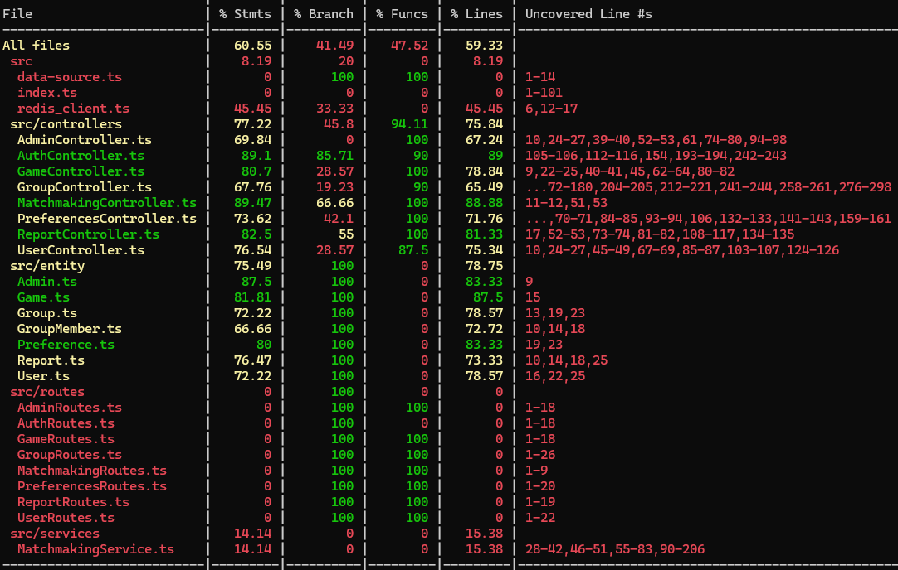
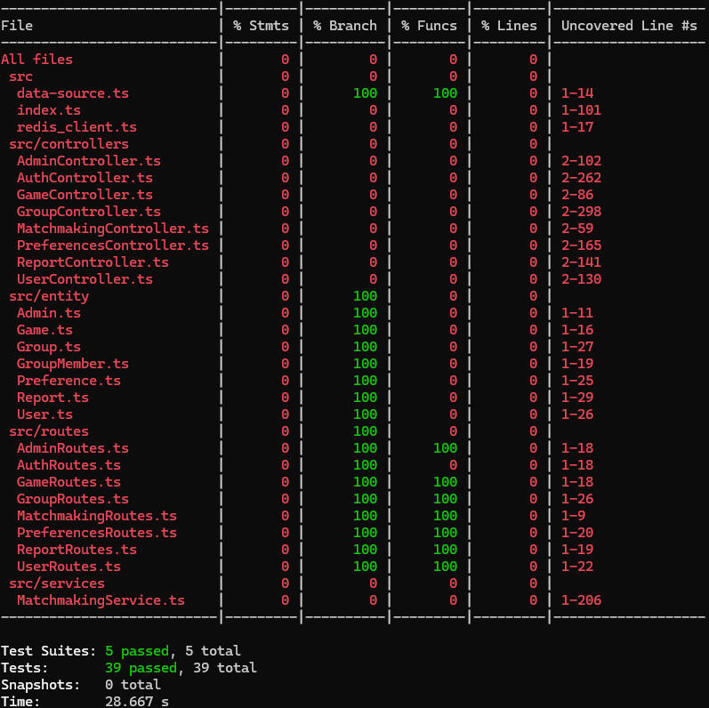
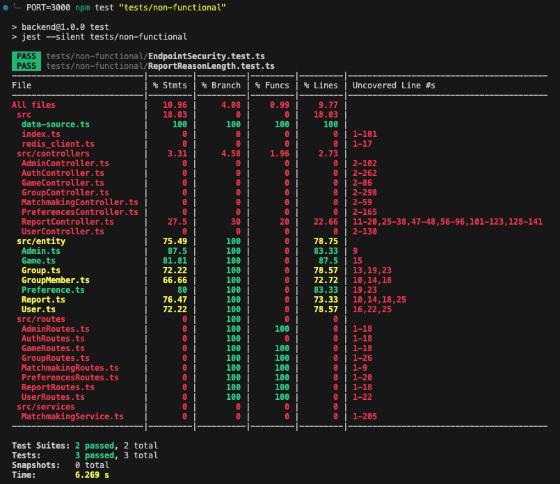
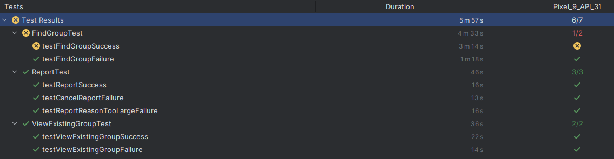
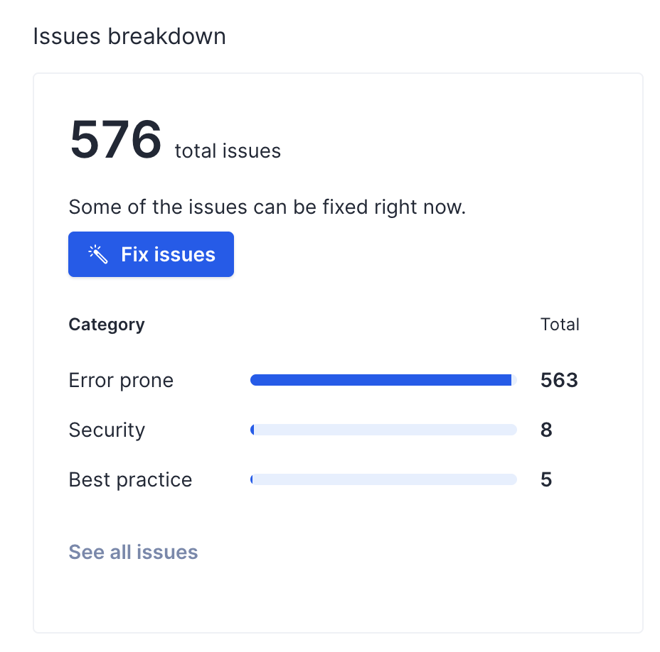
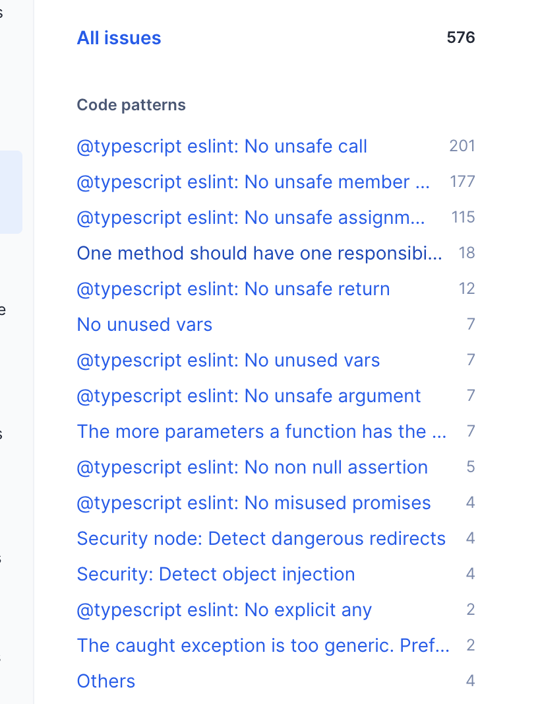

# Example M5: Testing and Code Review

## 1. Change History

| **Change Date**   | **Modified Sections** | **Rationale** |
| ----------------- | --------------------- | ------------- |
| _Nothing to show_ |

### 2.1. Locations of Back-end Tests and Instructions to Run Them

#### 2.1.1. Tests

| **Interface**                       | **URL**                                | **Type** | **Test without Mocks**                                                                                                                                                    | **Test with Mocks**                                                                                                                                                       | **Mocked Components** |
|-------------------------------------|----------------------------------------|----------|---------------------------------------------------------------------------------------------------------------------------------------------------------------------------|---------------------------------------------------------------------------------------------------------------------------------------------------------------------------|-----------------------|
| **Get All Admins**                  | `/admins`                             | GET      | [AdminController.test.ts#L9](https://github.com/SanHalacoglu/GameOn/blob/main/backend/tests/without-mocks/controllers/AdminController.test.ts#L9)                         | [AdminController.test.ts#L38](https://github.com/SanHalacoglu/GameOn/blob/main/backend/tests/with-mocks/controllers/AdminController.test.ts#L38)                         | DB                    |
| **Get Admin by ID**                 | `/admins/:id`                         | GET      | [AdminController.test.ts#L19](https://github.com/SanHalacoglu/GameOn/blob/main/backend/tests/without-mocks/controllers/AdminController.test.ts#L19)                       | [AdminController.test.ts#L50](https://github.com/SanHalacoglu/GameOn/blob/main/backend/tests/with-mocks/controllers/AdminController.test.ts#L50)                       | DB                    |
| **Create Admin**                    | `/admins`                             | POST     | [AdminController.test.ts#L34](https://github.com/SanHalacoglu/GameOn/blob/main/backend/tests/without-mocks/controllers/AdminController.test.ts#L34)                       | [AdminController.test.ts#L62](https://github.com/SanHalacoglu/GameOn/blob/main/backend/tests/with-mocks/controllers/AdminController.test.ts#L62)                       | DB                    |
| **Update Admin**                    | `/admins/:id`                         | PUT      | [AdminController.test.ts#L49](https://github.com/SanHalacoglu/GameOn/blob/main/backend/tests/without-mocks/controllers/AdminController.test.ts#L49)                       | [AdminController.test.ts#L78](https://github.com/SanHalacoglu/GameOn/blob/main/backend/tests/with-mocks/controllers/AdminController.test.ts#L78)                       | DB                    |
| **Delete Admin**                    | `/admins/:id`                         | DELETE   | [AdminController.test.ts#L61](https://github.com/SanHalacoglu/GameOn/blob/main/backend/tests/without-mocks/controllers/AdminController.test.ts#L61)                       | [AdminController.test.ts#L90](https://github.com/SanHalacoglu/GameOn/blob/main/backend/tests/with-mocks/controllers/AdminController.test.ts#L90)                       | DB                    |
| **Get All Games**                   | `/games`                              | GET      | [GameController.test.ts#L12](https://github.com/SanHalacoglu/GameOn/blob/main/backend/tests/without-mocks/controllers/GameController.test.ts#L12)                         | [GameController.test.ts#L28](https://github.com/SanHalacoglu/GameOn/blob/main/backend/tests/with-mocks/controllers/GameController.test.ts#L28)                         | DB                    |
| **Get Game by ID**                  | `/games/:id`                          | GET      | [GameController.test.ts#L22](https://github.com/SanHalacoglu/GameOn/blob/main/backend/tests/without-mocks/controllers/GameController.test.ts#L22)                         | [GameController.test.ts#L40](https://github.com/SanHalacoglu/GameOn/blob/main/backend/tests/with-mocks/controllers/GameController.test.ts#L40)                         | DB                    |
| **Create Game**                     | `/games`                              | POST     | [GameController.test.ts#L34](https://github.com/SanHalacoglu/GameOn/blob/main/backend/tests/without-mocks/controllers/GameController.test.ts#L34)                         | [GameController.test.ts#L52](https://github.com/SanHalacoglu/GameOn/blob/main/backend/tests/with-mocks/controllers/GameController.test.ts#L52)                         | DB                    |
| **Update Game**                     | `/games/:id`                          | PUT      | [GameController.test.ts#L49](https://github.com/SanHalacoglu/GameOn/blob/main/backend/tests/without-mocks/controllers/GameController.test.ts#L49)                         | [GameController.test.ts#L64](https://github.com/SanHalacoglu/GameOn/blob/main/backend/tests/with-mocks/controllers/GameController.test.ts#L64)                         | DB                    |
| **Delete Game**                     | `/games/:id`                          | DELETE   | [GameController.test.ts#L61](https://github.com/SanHalacoglu/GameOn/blob/main/backend/tests/without-mocks/controllers/GameController.test.ts#L61)                         | [GameController.test.ts#L76](https://github.com/SanHalacoglu/GameOn/blob/main/backend/tests/with-mocks/controllers/GameController.test.ts#L76)                         | DB                    |
| **Get All Groups**                  | `/groups`                             | GET      | [GroupController.test.ts#L23](https://github.com/SanHalacoglu/GameOn/blob/main/backend/tests/without-mocks/controllers/GroupController.test.ts#L23)                       | [GroupController.test.ts#L36](https://github.com/SanHalacoglu/GameOn/blob/main/backend/tests/with-mocks/controllers/GroupController.test.ts#L36)                       | group DB              |
| **Get Group by ID**                 | `/groups/:group_id`                   | GET      | [GroupController.test.ts#L30](https://github.com/SanHalacoglu/GameOn/blob/main/backend/tests/without-mocks/controllers/GroupController.test.ts#L30)                       | [GroupController.test.ts#L48](https://github.com/SanHalacoglu/GameOn/blob/main/backend/tests/with-mocks/controllers/GroupController.test.ts#L48)                       | group DB              |
| **Create Group**                    | `/groups`                             | POST     | [GroupController.test.ts#L37](https://github.com/SanHalacoglu/GameOn/blob/main/backend/tests/without-mocks/controllers/GroupController.test.ts#L37)                       | [GroupController.test.ts#L60](https://github.com/SanHalacoglu/GameOn/blob/main/backend/tests/with-mocks/controllers/GroupController.test.ts#L60)                       | group DB              |
| **Update Group**                    | `/groups/:group_id`                   | PUT      | [GroupController.test.ts#L44](https://github.com/SanHalacoglu/GameOn/blob/main/backend/tests/without-mocks/controllers/GroupController.test.ts#L44)                       | [GroupController.test.ts#L72](https://github.com/SanHalacoglu/GameOn/blob/main/backend/tests/with-mocks/controllers/GroupController.test.ts#L72)                       | group DB              |
| **Delete Group**                    | `/groups/:group_id`                   | DELETE   | [GroupController.test.ts#L51](https://github.com/SanHalacoglu/GameOn/blob/main/backend/tests/without-mocks/controllers/GroupController.test.ts#L51)                       | [GroupController.test.ts#L84](https://github.com/SanHalacoglu/GameOn/blob/main/backend/tests/with-mocks/controllers/GroupController.test.ts#L84)                       | group DB              |
| **Join Group**                      | `/groups/:group_id/join`              | POST     | [GroupController.test.ts#L74](https://github.com/SanHalacoglu/GameOn/blob/main/backend/tests/without-mocks/controllers/GroupController.test.ts#L74)                       | [GroupController.test.ts#L96](https://github.com/SanHalacoglu/GameOn/blob/main/backend/tests/with-mocks/controllers/GroupController.test.ts#L96)                       | group DB              |
| **Leave Group**                     | `/groups/:group_id/leave`             | DELETE   | [GroupController.test.ts#L87](https://github.com/SanHalacoglu/GameOn/blob/main/backend/tests/without-mocks/controllers/GroupController.test.ts#L87)                       | [GroupController.test.ts#L108](https://github.com/SanHalacoglu/GameOn/blob/main/backend/tests/with-mocks/controllers/GroupController.test.ts#L108)                     | group DB              |
| **Get Group Members**               | `/groups/:group_id/members`           | GET      | Not available                                                                                                                                                            | [GroupController.test.ts#L120](https://github.com/SanHalacoglu/GameOn/blob/main/backend/tests/with-mocks/controllers/GroupController.test.ts#L120)                     | group DB              |
| **Get Group URL**                   | `/groups/:group_id/url`               | GET      | [GroupController.test.ts#L100](https://github.com/SanHalacoglu/GameOn/blob/main/backend/tests/without-mocks/controllers/GroupController.test.ts#L100)                     | [GroupController.test.ts#L132](https://github.com/SanHalacoglu/GameOn/blob/main/backend/tests/with-mocks/controllers/GroupController.test.ts#L132)                     | group DB              |
| **Initiate Matchmaking**            | `/matchmaking/initiate`               | POST     | Not available                                                                                                                                                            | [MatchmakingController.test.ts#L47](https://github.com/SanHalacoglu/GameOn/blob/main/backend/tests/with-mocks/controllers/MatchmakingController.test.ts#L47)           | database, redis        |
| **Check Matchmaking Status**        | `/matchmaking/status/:discord_id`     | GET      | Not available                                                                                                                                                            | [MatchmakingController.test.ts#L139](https://github.com/SanHalacoglu/GameOn/blob/main/backend/tests/with-mocks/controllers/MatchmakingController.test.ts#L139)         | database, redis        |
| **Get All Preferences**             | `/preferences`                        | GET      | [PreferencesController.test.ts#L28](https://github.com/SanHalacoglu/GameOn/blob/main/backend/tests/without-mocks/controllers/PreferencesController.test.ts#L28)          | [PreferencesController.test.ts#L39](https://github.com/SanHalacoglu/GameOn/blob/main/backend/tests/with-mocks/controllers/PreferencesController.test.ts#L39)            | database               |
| **Get Preferences by ID**           | `/preferences/:id`                   | GET      | [PreferencesController.test.ts#L36](https://github.com/SanHalacoglu/GameOn/blob/main/backend/tests/without-mocks/controllers/PreferencesController.test.ts#L36)          | [PreferencesController.test.ts#L51](https://github.com/SanHalacoglu/GameOn/blob/main/backend/tests/with-mocks/controllers/PreferencesController.test.ts#L51)            | database               |
| **Create Preferences**              | `/preferences`                        | POST     | [PreferencesController.test.ts#L49](https://github.com/SanHalacoglu/GameOn/blob/main/backend/tests/without-mocks/controllers/PreferencesController.test.ts#L49)          | [PreferencesController.test.ts#L63](https://github.com/SanHalacoglu/GameOn/blob/main/backend/tests/with-mocks/controllers/PreferencesController.test.ts#L63)            | database               |
| **Update Preferences**              | `/preferences/:id`                   | PUT      | [PreferencesController.test.ts#L61](https://github.com/SanHalacoglu/GameOn/blob/main/backend/tests/without-mocks/controllers/PreferencesController.test.ts#L61)          | [PreferencesController.test.ts#L75](https://github.com/SanHalacoglu/GameOn/blob/main/backend/tests/with-mocks/controllers/PreferencesController.test.ts#L75)            | database               |
| **Delete Preferences**              | `/preferences/:id`                   | DELETE   | Not available                                                                                                                                                            | [PreferencesController.test.ts#L87](https://github.com/SanHalacoglu/GameOn/blob/main/backend/tests/with-mocks/controllers/PreferencesController.test.ts#L87)            | database               |
| **Get Preferences by User ID**      | `/preferences/user/:userId`          | GET      | [PreferencesController.test.ts#L43](https://github.com/SanHalacoglu/GameOn/blob/main/backend/tests/without-mocks/controllers/PreferencesController.test.ts#L43)          | [PreferencesController.test.ts#L99](https://github.com/SanHalacoglu/GameOn/blob/main/backend/tests/with-mocks/controllers/PreferencesController.test.ts#L99)            | database               |
| **Get All Reports**                 | `/reports`                            | GET      | Not available                                                                                                                                                            | [ReportController.test.ts#L49](https://github.com/SanHalacoglu/GameOn/blob/main/backend/tests/with-mocks/controllers/ReportController.test.ts#L49)                     | database               |
| **Get Report by ID**                | `/reports/:id`                        | GET      | Not available                                                                                                                                                            | [ReportController.test.ts#L64](https://github.com/SanHalacoglu/GameOn/blob/main/backend/tests/with-mocks/controllers/ReportController.test.ts#L64)                     | database               |
| **Create Report**                   | `/reports`                            | POST     | Not available                                                                                                                                                            | [ReportController.test.ts#L98](https://github.com/SanHalacoglu/GameOn/blob/main/backend/tests/with-mocks/controllers/ReportController.test.ts#L98)                     | database               |
| **Resolve Report**                  | `/reports/:id/resolve`                | PUT      | Not available                                                                                                                                                            | [ReportController.test.ts#L144](https://github.com/SanHalacoglu/GameOn/blob/main/backend/tests/with-mocks/controllers/ReportController.test.ts#L144)                   | database               |
| **Delete Report**                   | `/reports/:id`                        | DELETE   | Not available                                                                                                                                                            | [ReportController.test.ts#L191](https://github.com/SanHalacoglu/GameOn/blob/main/backend/tests/with-mocks/controllers/ReportController.test.ts#L191)                   | database               |
| **Get All Users**                   | `/users`                              | GET      | [UserController.test.ts#L14](https://github.com/SanHalacoglu/GameOn/blob/main/backend/tests/without-mocks/controllers/UserController.test.ts#L14)                        | [UserController.test.ts#L41](https://github.com/SanHalacoglu/GameOn/blob/main/backend/tests/with-mocks/controllers/UserController.test.ts#L41)                        | database               |
| **Get User by ID**                  | `/users/:id`                          | GET      | [UserController.test.ts#L23](https://github.com/SanHalacoglu/GameOn/blob/main/backend/tests/without-mocks/controllers/UserController.test.ts#L23)                        | [UserController.test.ts#L54](https://github.com/SanHalacoglu/GameOn/blob/main/backend/tests/with-mocks/controllers/UserController.test.ts#L54)                        | database               |
| **Create User**                     | `/users`                              | POST     | [UserController.test.ts#L32](https://github.com/SanHalacoglu/GameOn/blob/main/backend/tests/without-mocks/controllers/UserController.test.ts#L32)                        | [UserController.test.ts#L67](https://github.com/SanHalacoglu/GameOn/blob/main/backend/tests/with-mocks/controllers/UserController.test.ts#L67)                        | database               |
| **Update User**                     | `/users/:id`                          | PUT      | [UserController.test.ts#L41](https://github.com/SanHalacoglu/GameOn/blob/main/backend/tests/without-mocks/controllers/UserController.test.ts#L41)                        | [UserController.test.ts#L80](https://github.com/SanHalacoglu/GameOn/blob/main/backend/tests/with-mocks/controllers/UserController.test.ts#L80)                        | database               |
| **Delete User**                     | `/users/:id`                          | DELETE   | [UserController.test.ts#L50](https://github.com/SanHalacoglu/GameOn/blob/main/backend/tests/without-mocks/controllers/UserController.test.ts#L50)                        | [UserController.test.ts#L93](https://github.com/SanHalacoglu/GameOn/blob/main/backend/tests/with-mocks/controllers/UserController.test.ts#L93)                        | database               |
| **Get User Groups**                 | `/users/:id/groups`                   | GET      | [UserController.test.ts#L74](https://github.com/SanHalacoglu/GameOn/blob/main/backend/tests/without-mocks/controllers/UserController.test.ts#L74)                        | [UserController.test.ts#L106](https://github.com/SanHalacoglu/GameOn/blob/main/backend/tests/with-mocks/controllers/UserController.test.ts#L106)                      | database               |
| **Ban User**                        | `/users/:id/ban`                      | PUT      | [UserController.test.ts#L97](https://github.com/SanHalacoglu/GameOn/blob/main/backend/tests/without-mocks/controllers/UserController.test.ts#L97)                        | [UserController.test.ts#L119](https://github.com/SanHalacoglu/GameOn/blob/main/backend/tests/with-mocks/controllers/UserController.test.ts#L119)                      | database               |
| **Protect Endpoint**                      | `/auth/protect`              | Not available                                                                                                                                                              | [`AuthController.test.ts`#L9](https://github.com/SanHalacoglu/GameOn/blob/main/backend/tests/with-mocks/controllers/AuthController.test.ts#L9)                            | `session`                                 |
| **Handle Register**                       | `/auth/register`             | Not available                                                                                                                                                              | [`AuthController.test.ts`#L31](https://github.com/SanHalacoglu/GameOn/blob/main/backend/tests/with-mocks/controllers/AuthController.test.ts#L31)                           | `session`, `axios (DB)`                   |
| **Handle LoginOrRedirect**                | `/auth/login-or-redirect`    | Not available                                                                                                                                                              | [`AuthController.test.ts`#L75](https://github.com/SanHalacoglu/GameOn/blob/main/backend/tests/with-mocks/controllers/AuthController.test.ts#L75)                           | `session`, `axios (DB)`                   |
| **Handle Logout**                         | `/auth/logout`               | Not available                                                                                                                                                              | [`AuthController.test.ts`#L108](https://github.com/SanHalacoglu/GameOn/blob/main/backend/tests/with-mocks/controllers/AuthController.test.ts#L108)                         | `session`                                 |
| **Handle Discord Callback**               | `/auth/discord-callback`     | Not available                                                                                                                                                              | [`AuthController.test.ts`#L130](https://github.com/SanHalacoglu/GameOn/blob/main/backend/tests/with-mocks/controllers/AuthController.test.ts#L130)                         | `session`, `axios (Discord API)`, `axios (DB)` |

#### 2.1.2. Commit Hash Where Tests Run

`[Insert Commit SHA here]`

#### 2.1.3. Explanation on How to Run the Tests

1. Navigate to 
[GitHub Actions](https://github.com/cjohst/GameOn/actions)

2. Click **"Deploy Test Environment"**

3. Click **"Run Workflow"**

4. Click the launched workflow

5. Await test results

### 2.2. GitHub Actions Configuration Location

`~/.github/workflows/test-deployment.yml`

### 2.3. Jest Coverage Report Screenshots With Mocks



### 2.4. Jest Coverage Report Screenshots Without Mocks


---

### 2.5 Justification for Low Test Coverage

As you can see, our tests are configured to run against a dockerized backend so Jest cannot properly instrument the code. Thus, we only collect code coverage in mocked tests and do not collect any coverage data from unmocked tests

## 3. Back-end Test Specification: Tests of Non-Functional Requirements

### 3.1. Test Locations in Git

| **Non-Functional Requirement**  | **Location in Git**                              |
| ------------------------------- | ------------------------------------------------ |
| **Endpoints Need To Be Secured By Sessions** | [EndpointSecurity.test.ts#L49](https://github.com/SanHalacoglu/GameOn/blob/main/backend/tests/non-functional/EndpointSecurity.test.ts#L49) |
| **Report Reasoning Can Not Exceed 500 Characters** | [EndpointSecurity.test.ts#L49](https://github.com/SanHalacoglu/GameOn/blob/main/backend/tests/non-functional/ReportReasonLength.test.ts#L49) |

### 3.2. Test Verification and Logs

- **Performance (Response Time)**

  - **Verification:** 
  - Endpoints Need To Be Secured By Sessisons: We have a system that verifies users through sessions to ensure they are authenticated via Discord OAuth, which is critical for the security and viability of our platform. To enforce this, we protect key endpoints by validating sessions on incoming HTTPS requests. In our test suite, we simulate unauthorized access by making HTTPS requests without cookies, where the session data would normally be stored, and expect protected endpoints like /auth/register and /auth/logout to return a 401 Unauthorized status. While there are additional protected endpoints, these two are the most important for demonstration purposes.
  - Report Reasoning Can Not Exceed 500 Characters: Users can report other users they have formed groups with, allowing admins to review reports and help maintain a safer environment on our platform. To prevent database bloat and potential security issues, such as memory exhaustion, we enforce a 500-character limit on the report reason in the backend. To ensure this validation works as expected, we’ve added a test that submits a report with more than 500 characters and checks that a 400 Bad Request response is returned.
  
  - **Log Output**
  

- **Chat Data Security**
  - **Verification:** ...
  - **Log Output**
    ```
    [Placeholder for chat security test logs]
    ```

---

## 4. Front-end Test Specification

### 4.1. Location in Git of Front-end Test Suite:

`frontend/app/src/androidTest/java/com/example/gameon/`

### 4.2. Tests



- **Use Case: Find Group**
  - **Expected Behaviors:**
    | **Scenario Steps** | **Test Case Steps** |
    | ------------------ | ------------------- |
    | 1. User is on the main page of GameOn. | Log into GameOn and verify main page is opened. |
    | 2. User clicks the “Find Group” button. | Check that the button labelled Find Group is present on screen.<br>Click the Find Group button. |
    | 3. The "Find Group" button becomes disabled and says "Finding". | Check that the Find Group button text switches to "Finding". |
    | 4. A matchmaking request is submitted, and the user is added to the matchmaking queue. |  |
    | 5. A group is found based on the user's preferences. |  |
    | 6. A popup appears stating "You have been matched with a group!" | Wait for up to a minute (timeout) and check that a matchmaking popup appears with the text: "You have been matched with a group! |
    | 7. The new group appears in the "My Groups" section of the main page. | Check that a group with the name "Valorant Matchmaking Group" is present under "My Groups" |

  - **Test Logs:**
    ```
    STATUS: FAILED
    03-14 22:16:09.986 17778 17902 I TestRunner: started: testFindGroupSuccess(com.example.gameon.FindGroupTest)
    03-14 22:16:10.109 17778 17902 I Tracing : Tracer added: class androidx.test.platform.tracing.AndroidXTracer
    03-14 22:19:24.567 17778 17902 E TestRunner: failed: testFindGroupSuccess(com.example.gameon.FindGroupTest)
    03-14 22:19:24.567 17778 17902 E TestRunner: 	at androidx.compose.ui.test.AndroidComposeUiTestEnvironment$AndroidComposeUiTestImpl.waitUntil(ComposeUiTest.android.kt:441)
    03-14 22:19:24.567 17778 17902 E TestRunner: 	at androidx.compose.ui.test.junit4.AndroidComposeTestRule.waitUntil(AndroidComposeTestRule.android.kt:306)
    03-14 22:19:24.567 17778 17902 E TestRunner: 	at androidx.test.internal.runner.junit4.statement.RunBefores.evaluate(RunBefores.java:80)
    03-14 22:19:24.568 17778 17902 E TestRunner: 	at androidx.test.runner.AndroidJUnit4.run(AndroidJUnit4.java:123)
    03-14 22:19:24.568 17778 17902 E TestRunner: 	at androidx.test.internal.runner.TestExecutor.execute(TestExecutor.java:68)
    03-14 22:19:24.568 17778 17902 E TestRunner: 	at androidx.test.internal.runner.TestExecutor.execute(TestExecutor.java:59)
    03-14 22:19:24.568 17778 17902 E TestRunner: 	at androidx.test.runner.AndroidJUnitRunner.onStart(AndroidJUnitRunner.java:463)
    03-14 22:19:24.571 17778 17902 I TestRunner: finished: testFindGroupSuccess(com.example.gameon.FindGroupTest)
    androidx.compose.ui.test.ComposeTimeoutException: Condition still not satisfied after 120000 ms
    at androidx.compose.ui.test.AndroidComposeUiTestEnvironment$AndroidComposeUiTestImpl.waitUntil(ComposeUiTest.android.kt:441)
    at androidx.compose.ui.test.junit4.AndroidComposeTestRule.waitUntil(AndroidComposeTestRule.android.kt:306)
    at com.example.gameon.FindGroupTest.testFindGroupSuccess(FindGroupTest.kt:120)

    ```

- **Use Case: Find Group**
  - **Expected Behaviors:**
    | **Scenario Steps** | **Test Case Steps** |
    | ------------------ | ------------------- |
    | 1. User is on the main page of GameOn. | Log into GameOn and verify main page is opened. |
    | 2. User clicks the “Find Group” button. | Check that the button labelled Find Group is present on screen.<br>Click the Find Group button. |
    | 3. The "Find Group" button becomes disabled and says "Finding". | Check that the Find Group button text switches to "Finding". |
    | 4. A matchmaking request is submitted, and the user is added to the matchmaking queue. |  |
    | 5. A group is not found based on the user's preferences within the timeout of 1 minute. |  |
    | 6. A popup appears stating "Matchmaking timed out. Please try again." | Wait for up to a minute (timeout) and check that a matchmaking popup appears with the text: "Matchmaking timed out. Please try again." |

  - **Test Logs:**
    ```
    STATUS: PASSED
    03-14 22:19:25.966 17778 17902 I TestRunner: started: testFindGroupFailure(com.example.gameon.FindGroupTest)
    03-14 22:20:44.757 17778 17902 I TestRunner: finished: testFindGroupFailure(com.example.gameon.FindGroupTest)
    03-14 22:20:44.758 17778 17902 I TestRunner: passed: testFindGroupFailure(com.example.gameon.FindGroupTest)

    ```

- **Use Case: Navigate to Existing Group**
  - **Expected Behaviors:**
    | **Scenario Steps** | **Test Case Steps** |
    | ------------------ | ------------------- |
    | 1. User is on the main page of GameOn. | Log into GameOn and verify main page is opened. |
    | 2. User clicks on an existing group from the "My Groups" section. | Check that the expected test group "Valorant Matchmaking Group" is present on screen.<br>Click the "Valorant Matchmaking Group" button. |
    | 3. The View Existing Groups page opens, displaying the group name, group members, and a "Go to Discord Group" button. | Check that the title "Valorant Matchmaking Group" is present.<br> Check that the test group member "sanhal23" is present.<br> Check that the "Go to Discord Group" is present. |
    | 4. User clicks the "Go to Discord Group". | Click the "Go to Discord Group" button |
    | 5. Chrome opens the Discord web version and displays the newly created group with the added members. | Check that text "discord.com/channels/" is present in the URL, to verify browser has launched. |

  - **Test Logs:**
    ```
    STATUS: PASSED
    03-14 22:21:37.175 17778 17902 I TestRunner: started: testViewExistingGroupSuccess(com.example.gameon.ViewExistingGroupTest)
    03-14 22:21:59.986 17778 17902 I TestRunner: finished: testViewExistingGroupSuccess(com.example.gameon.ViewExistingGroupTest)
    03-14 22:21:59.987 17778 17902 I TestRunner: passed: testViewExistingGroupSuccess(com.example.gameon.ViewExistingGroupTest)
    ```

- **Use Case: Navigate to Existing Group**
  - **Expected Behaviors:**
    | **Scenario Steps** | **Test Case Steps** |
    | ------------------ | ------------------- |
    | 1. User is on the main page of GameOn. | Log into GameOn and verify main page is opened. |
    | 2. User tries to click on an existing group from "My Groups" but the list is empty. | Check that the test group "Valorant Matchmaking Group" is initially present. <br> Clear the group list dynamically during runtime. <br>Attempt to find the group in the UI. |
    | 3. User attempts to select the now non-existent group. | Try to click on "Valorant Matchmaking Group" after it has been removed. |
    | 4. System displays an error message instead of proceeding. | Check for the "No groups found" text on screen. |
    | 5. User cannot proceed to the View Existing Group page. |  |

  - **Test Logs:**
    ```
    STATUS: PASSED
    03-14 22:21:59.989 17778 17902 I TestRunner: started: testViewExistingGroupFailure(com.example.gameon.ViewExistingGroupTest)
    03-14 22:22:14.192 17778 17902 I TestRunner: finished: testViewExistingGroupFailure(com.example.gameon.ViewExistingGroupTest)
    03-14 22:22:14.193 17778 17902 I TestRunner: passed: testViewExistingGroupFailure(com.example.gameon.ViewExistingGroupTest)
    ```

- **Use Case: Submit Report**

  - **Expected Behaviors:**

    | **Scenario Steps** | **Test Case Steps** |
    | ------------------ | ------------------- |
    | 1. User is on the main page of GameOn. | Log into GameOn and verify main page is opened. |
    | 2. User clicks the “Submit a Report” button. | Check that the button labelled Submit a Report is present on screen.<br>Click the Find Group button. |
    | 3. User is now on the Reports page of GameOn. | Check that the button labelled Submit Report is present on screen and is not enabled. |
    | 4. User selects a group from the Group dropdown menu. | Check that the dropdown menu labelled Group is present on screen.<br> Click on the dropdown menu and check that at least on dropdown value exists.<br> Click on the first dropdown option, check that the dropdown menu is closed, and check that the selected value is now displayed on the dropdown.<br> Lastly, check that the Submit Report button is still not enabled. |
    | 5. User selects a user to report from the User dropdown menu. | Check that the dropdown menu labelled User is present on screen.<br> Click on the dropdown menu and check that at least on dropdown value exists.<br> Click on the first dropdown option, check that the dropdown menu is closed, and check that the selected value is now displayed on the dropdown.<br> Lastly, check that the Submit Report button is still not enabled. |
    | 6. User types a reason for reporting the selected user in the Reason text input | Check that the text input labelled Reason is present on screen.<br> Click on the text input and input a string of text with a length less than 500 characters.<br> Lastly, check that the Submit Report button is now enabled. |
    | 7. User submits the report by clicking the "Submit Report" button and is taken back to the main page. | Click Submit Report button. |
    | 8. User clicks the "View Reports" button and navigates to the List Reports page of GameOn. | Check that the button labelled View Reports is present on screen and click that button. |
    | 9. User looks at the list of reports and confirms that the submitted report is present at the bottom of the list. | Check that the list of submitted reports is displayed and has at least one item.<br> Check that the last item in this list displays the username of the user who had been reported during this sequence. |

  - **Test Logs:**
    ```
    STATUS: PASSED
    03-14 22:20:46.112 17778 17902 I TestRunner: started: testReportSuccess(com.example.gameon.ReportTest)
    03-14 22:21:02.942 17778 17902 I TestRunner: finished: testReportSuccess(com.example.gameon.ReportTest)
    03-14 22:21:02.943 17778 17902 I TestRunner: passed: testReportSuccess(com.example.gameon.ReportTest)
    ```

- **Use Case: Submit Report**

  - **Expected Behaviors:**

    | **Scenario Steps** | **Test Case Steps** |
    | ------------------ | ------------------- |
    | 1. User is on the main page of GameOn. | Log into GameOn and verify main page is opened. |
    | 2. User clicks the “Submit a Report” button. | Check that the button labelled Submit a Report is present on screen.<br>Click the Find Group button. |
    | 3. User is now on the Reports page of GameOn. | Check that the button labelled Submit Report is present on screen and is not enabled. |
    | 4. User cancels the process by clicking the "Cancel" button | Check that the button labelled Cancel is displayed.<br> Click the Cancel button. |
    | 5. User is back on the main page of GameOn. | Verify that the main page is opened. |


  - **Test Logs:**
    ```
    STATUS: PASSED
    03-14 22:21:04.310 17778 17902 I TestRunner: started: testCancelReportFailure(com.example.gameon.ReportTest)
    03-14 22:21:18.089 17778 17902 I TestRunner: finished: testCancelReportFailure(com.example.gameon.ReportTest)
    03-14 22:21:18.090 17778 17902 I TestRunner: passed: testCancelReportFailure(com.example.gameon.ReportTest)
    ```

- **Use Case: Submit Report**

  - **Expected Behaviors:**

    | **Scenario Steps** | **Test Case Steps** |
    | ------------------ | ------------------- |
    | 1. User is on the main page of GameOn. | Log into GameOn and verify main page is opened. |
    | 2. User clicks the “Submit a Report” button. | Check that the button labelled Submit a Report is present on screen.<br>Click the Find Group button. |
    | 3. User is now on the Reports page of GameOn. | Check that the button labelled Submit Report is present on screen and is not enabled. |
    | 4. User selects a group from the Group dropdown menu. | Check that the dropdown menu labelled Group is present on screen.<br> Click on the dropdown menu and check that at least on dropdown value exists.<br> Click on the first dropdown option, check that the dropdown menu is closed, and check that the selected value is now displayed on the dropdown.<br> Lastly, check that the Submit Report button is still not enabled. |
    | 5. User selects a user to report from the User dropdown menu. | Check that the dropdown menu labelled User is present on screen.<br> Click on the dropdown menu and check that at least on dropdown value exists.<br> Click on the first dropdown option, check that the dropdown menu is closed, and check that the selected value is now displayed on the dropdown.<br> Lastly, check that the Submit Report button is still not enabled. |
    | 6. User types a reason for reporting the selected user in the Reason text input | Check that the text input labelled Reason is present on screen.<br> Click on the text input and input a string of text with a length more than 500 characters.<br> Lastly, check that the Submit Report button is now enabled. |
    | 7. User clicks the Submit Report button. | Click Submit Report button. |
    | 8. User can now see the Reason text input turn red and display an error message beneath it declaring the number of characters input should be less than 500. | |

  - **Test Logs:**
    ```
    STATUS: PASSED
    03-14 22:21:19.497 17778 17902 I TestRunner: started: testReportReasonTooLargeFailure(com.example.gameon.ReportTest)
    03-14 22:21:35.867 17778 17902 I TestRunner: finished: testReportReasonTooLargeFailure(com.example.gameon.ReportTest)
    03-14 22:21:35.867 17778 17902 I TestRunner: passed: testReportReasonTooLargeFailure(com.example.gameon.ReportTest)
    ```

---

## 5. Automated Code Review Results

### 5.1. Commit Hash Where Codacy Ran

`35b0261`

### 5.2. Unfixed Issues per Codacy Category



### 5.3. Unfixed Issues per Codacy Code Pattern



### 5.4. Justifications for Unfixed Issues

Upon integrating Codacy, over 600 issues were flagged. Due to limited time and the need to prioritize critical tasks, we focused on developing and stabilizing the testing framework to ensure core functionality. We attempted to fix some issues initially, but doing so caused delays in our testing framework development. As a result, we made a team decision not to address the remaining issues.

- ...